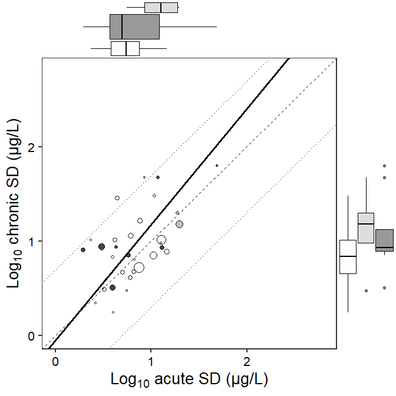
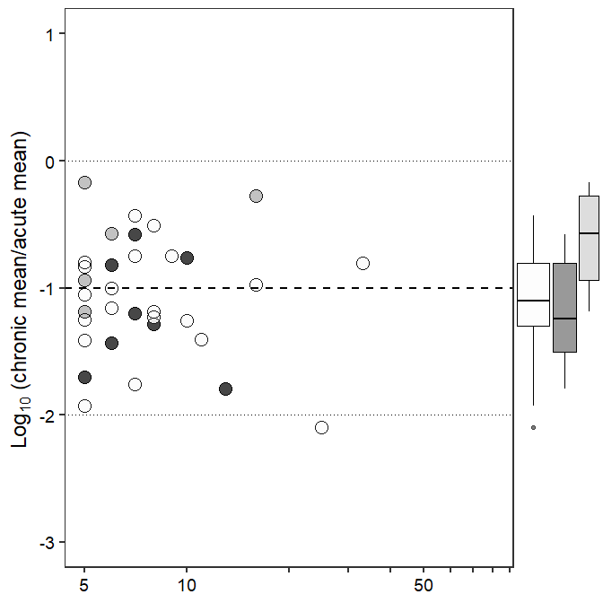
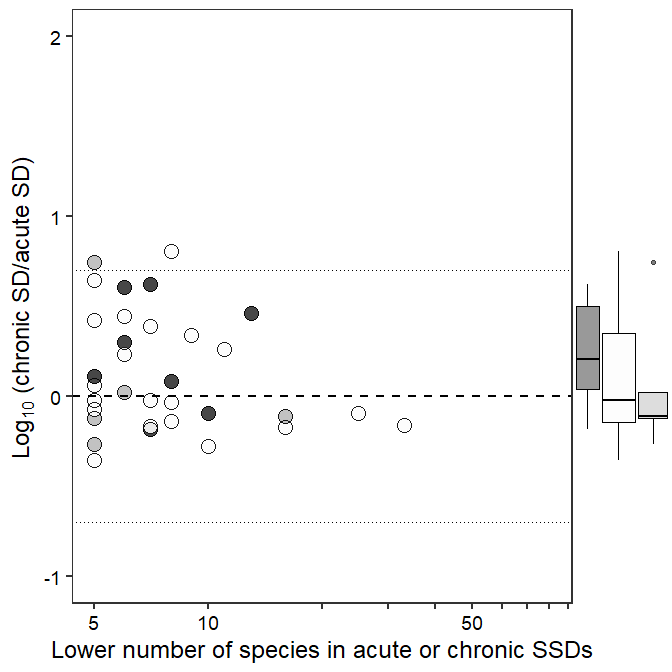
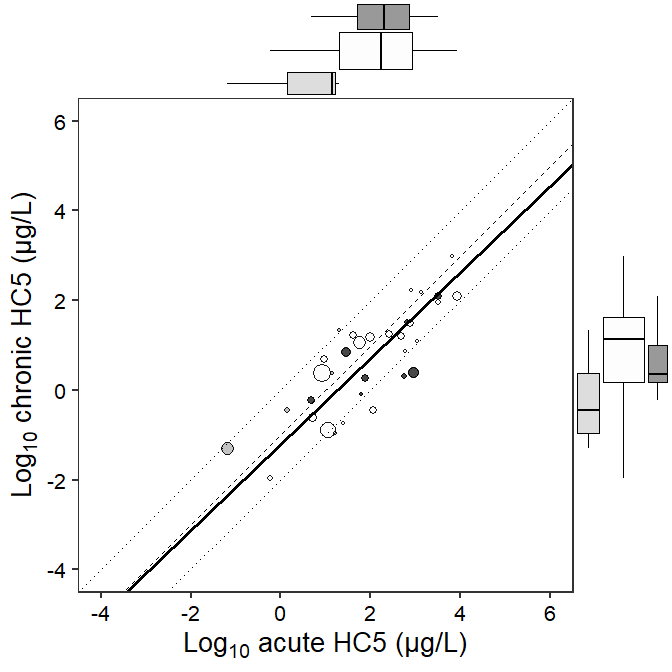

``` r
knitr::opts_chunk$set(echo = TRUE, message=FALSE,fig.path = "SSD_chronic_figs/figs-",fig.width=7,fig.height=7)
```

``` r
library(groundhog)

groundhog.library("openxlsx",'2020-09-14')  # load the version of the package that was available on the publication date of Hiki & Iwasaki (2020)
groundhog.library("tidyverse",'2020-09-14')
groundhog.library("ggplot2",'2020-09-14')
groundhog.library("ggExtra",'2020-09-14')
groundhog.library("smatr",'2020-09-14')
groundhog.library("EnvStats",'2020-09-14')


### 2: Import the example dataset ###
# This dataset "example.xlsx" includes 20,000 test records randomly selected from the "EnviroTox" database only for demonstration.
# All the data used in this study was collected from the "EnviroTox" database and please contact the authors if you like to exactly reproduce our results.

EnviroTox_test <- read.xlsx("example.xlsx", sheet=1)
EnviroTox_chem <- read.xlsx("example.xlsx", sheet=2)
EnviroTox_taxo <- read.xlsx("example.xlsx", sheet=3)


#### 3: Select and process the data ####
EnviroTox_test_selected <- EnviroTox_test %>%
  filter (Test.statistic=="EC50" & Test.type=="A" | Test.statistic=="LC50" & Test.type=="A" | Test.statistic=="NOEC" & Test.type=="C" | Test.statistic=="NOEL" & Test.type=="C") %>% 
  filter (Effect.is.5X.above.water.solubility =="0") %>%
  mutate (original.CAS = EnviroTox_chem[match(.$CAS, EnviroTox_chem$CAS),"original.CAS"] ) %>%
  mutate_at(vars(Effect.value), as.numeric) %>%
  mutate (Effect.value = replace(.$Effect.value, !is.na(.$Effect.value), .$Effect.value * 10^3) ) %>%  # transform unit (mg/L to ug/L)
  mutate (Unit = replace(Unit, Unit=="mg/L","µg/L"))


# calculate geometric mean and select chemicals analyzed based on the number of species
EnviroTox_test_selected2 <- aggregate(EnviroTox_test_selected$Effect.value,
by=list(original.CAS = EnviroTox_test_selected$original.CAS, Test.type=EnviroTox_test_selected$Test.type, Latin.name=EnviroTox_test_selected$Latin.name), function(x) geoMean(x) ) %>%
    rename(Effect.value=x) %>%
    mutate (Trophic.Level = EnviroTox_taxo[match (.$Latin.name, EnviroTox_taxo$Latin.name) ,"Trophic.Level"] ) %>%
   group_by(original.CAS,Test.type) %>% 
   filter(n()>=5)
# goodness-of-fit test
EnviroTox_test_fitness_sw <- aggregate(EnviroTox_test_selected2$Effect.value,
by=list(original.CAS=EnviroTox_test_selected2$original.CAS,
Test.type=EnviroTox_test_selected2$Test.type),
function(x) shapiro.test(log10( as.numeric(x) ) )$p.value  ) %>%
    dplyr::rename(p_value=x) %>%
    mutate(adj_p = p.adjust(p_value,"holm"))
not_fit_chem <- EnviroTox_test_fitness_sw[EnviroTox_test_fitness_sw$adj_p < 0.05 ,"original.CAS"]

#### 4: SSD estimation ####
EnviroTox_ssd <- aggregate(x=as.numeric(EnviroTox_test_selected2$Effect.value),
by=list(original.CAS=EnviroTox_test_selected2$original.CAS, Test.type=EnviroTox_test_selected2$Test.type),
FUN=function(x) mean(log10( x ) ) )  %>%
  mutate(sd=aggregate(EnviroTox_test_selected2$Effect.value,
by=list(EnviroTox_test_selected2$original.CAS, EnviroTox_test_selected2$Test.type), function(x) sd(log10( x ) ) )[,3]   )   %>%
  rename(mean=x) %>%
  mutate(HC5 = qlnorm (0.05, meanlog=log(10^mean), sdlog=log(10^sd) ) ) %>%
  mutate (Substance=EnviroTox_chem[match (.$original.CAS, EnviroTox_chem$original.CAS) ,"Chemical.name"]) %>%
  mutate (No_species = aggregate(EnviroTox_test_selected2$Latin.name,
by=list(EnviroTox_test_selected2$original.CAS,EnviroTox_test_selected2$Test.type), function(x) length(unique(x)) )[,3]) %>%
  mutate (No_trophic=aggregate(EnviroTox_test_selected2$Trophic.Level,
by=list(EnviroTox_test_selected2$original.CAS,EnviroTox_test_selected2$Test.type), function(x) length(unique (x)) )[,3]) %>%
  filter(!is.na(sd)) %>%
  mutate(Test.type = replace(Test.type, Test.type=="A", "Acute")) %>%
  mutate(Test.type = replace(Test.type, Test.type=="C", "Chronic"))%>%
  pivot_wider(names_from=Test.type, values_from=c("mean","sd","HC5","No_species","No_trophic")) %>%
  mutate (ConsensusMoA = EnviroTox_chem[match (.$original.CAS, EnviroTox_chem$original.CAS), "Consensus.MOA"] ) %>%
  mutate (ASTER = EnviroTox_chem[match (.$original.CAS, EnviroTox_chem$original.CAS) ,"ASTER"] )


EnviroTox_ssd$ConsensusMoA <- replace (EnviroTox_ssd$ConsensusMoA, which(EnviroTox_ssd$ConsensusMoA=="N"),"Narcotic")
EnviroTox_ssd$ConsensusMoA <- replace (EnviroTox_ssd$ConsensusMoA, which(EnviroTox_ssd$ConsensusMoA=="U"),"Unclassified")
EnviroTox_ssd$ConsensusMoA <- replace (EnviroTox_ssd$ConsensusMoA, which(EnviroTox_ssd$ConsensusMoA=="S"),"Specifically acting")
EnviroTox_ssd$ConsensusMoA <- as.factor(EnviroTox_ssd$ConsensusMoA)


#### 5: Select chemicals analyzed based on results of Shapiro-Wilk test and proportions of taxonomic groups ####
EnviroTox_ssd_HH <- EnviroTox_ssd %>%
  filter(! original.CAS %in% not_fit_chem ) %>%
  filter (No_trophic_Acute >= 2 & No_trophic_Chronic >=2 ) %>%
  separate (Substance, into=c("Short_name"), sep=";", extra="drop")
# Check the number of SSDs
# Acute and chronic SSDs for a total of 33 chemicals were derived in this case.
dim(EnviroTox_ssd_HH)
```

    ## [1] 33 14

``` r
#### 6: Fig.1A Relationship between chronic and acute SSD means ####
# standardized major axis regression
fit_mean_sma <- sma(data=EnviroTox_ssd_HH, mean_Chronic ~ mean_Acute)

# plot
mean_plot <-  ggplot(data=EnviroTox_ssd_HH, aes(x=mean_Acute, y=mean_Chronic, size=pmin(No_species_Chronic,No_species_Acute) ))+
  geom_point(alpha=0.9, aes(color=ConsensusMoA) )+
  geom_point(alpha=0.9, pch=21)+
  geom_abline(slope=1, intercept=0,size=0.5, lty="dotted")+
  geom_abline(slope=1, intercept=-1,size=0.5, lty="dashed")+
  geom_abline(slope=1, intercept=-2,size=0.5, lty="dotted")+
  theme_bw(base_size=20) +
  theme(axis.text = element_text(color="black"), panel.grid=element_blank(), legend.position = 'none' )+
  scale_color_grey(start=0.2,end=0.99)+
  xlab(expression(paste(Log[10]," acute mean (μg/L)")) )+
  ylab(expression(paste(Log[10]," chronic mean (μg/L)")) )+
  geom_abline(intercept=fit_mean_sma$coef[[1]][1,1], slope=fit_mean_sma$coef[[1]][2,1], col="black", size=1.2)
Fig1A<- ggMarginal(mean_plot, type = "box", margins = "both", size = 5, groupFill = TRUE)
Fig1A
```


``` r
#### 7: Fig. 1B Relationship between chronic and acute SSD SDs ####
# standardized major axis regression
fit_sd_sma <- sma(data=EnviroTox_ssd_HH, sd_Chronic ~ sd_Acute)

#plot
sd_plot <-  ggplot(data=EnviroTox_ssd_HH, aes(x=sd_Acute, y=sd_Chronic, size=pmin(No_species_Chronic, No_species_Acute) ))+
  geom_point(alpha=0.9, aes(color=ConsensusMoA) )+
  geom_point(alpha=0.9,pch=21)+
  geom_abline(slope=1, intercept=log10(5), size=0.5, lty="dotted")+
  geom_abline(slope=1, intercept=0, size=0.5, lty="dashed")+
  geom_abline(slope=1, intercept=-log10(5), size=0.5, lty="dotted")+
  theme_bw(base_size=20) + 
  theme(axis.text = element_text(color="black"), panel.grid=element_blank(), legend.position = 'none' )+
  scale_color_grey(start=0.2, end=0.99)+
  xlim(0, 2.8) + ylim(0, 2.8)+
  xlab(expression(paste(Log[10]," acute SD (μg/L)")) )+
  ylab(expression(paste(Log[10]," chronic SD (μg/L)")) )+
  geom_abline(intercept=fit_sd_sma$coef[[1]][1,1], slope=fit_sd_sma$coef[[1]][2,1], col="black", size=1.2)
Fig1B <- ggMarginal(sd_plot,type = "box",margins = "both", size = 5, groupFill = TRUE)
Fig1B
```



``` r
#### 8: Fig. 2 Relationship between the number of species and ratios of chronic to acute SSD parameters ####
#Fig. 2A
mean_species <- ggplot(data=EnviroTox_ssd_HH, aes(y=mean_Chronic - mean_Acute, x=pmin(No_species_Chronic, No_species_Acute)))+
  geom_point(alpha=0.9, size=5, aes(color=ConsensusMoA) )+
  geom_point(alpha=0.9, size=5, pch=21)+
  geom_abline(intercept=0, slope=0, lty="dotted")+
  geom_abline(intercept=-2, slope=0, lty="dotted")+
  geom_abline(slope=0, intercept=-1, lty="dashed", size=0.8)+
  scale_color_grey(start=0.2,end=0.99, name="MoA")+
  scale_x_continuous(breaks=c(5,seq(10,100,by=10)), labels=c("5","10",rep("",3),"50",rep("",5)),limits=c(5,80),trans="log10")+
  theme_bw(base_size=18)+  ylim(-3,1)+
  theme(axis.text = element_text(color="black"), panel.grid=element_blank(), legend.position="none", axis.title.x=element_blank() )+
  xlab("")+
  ylab(expression(paste(Log[10]," (chronic mean/acute mean)")) )
Fig2A <- ggMarginal(mean_species, type = "box", margins="y", size = 5, groupFill = TRUE)
Fig2A
```



``` r
#Fig. 2B
sd_species <-  ggplot(data=EnviroTox_ssd_HH, aes(y=sd_Chronic - sd_Acute, x=pmin(No_species_Chronic, No_species_Acute) ))+
  geom_point(alpha=0.9, size=5, aes(color=ConsensusMoA) )+
  geom_point(alpha=0.9, size=5, pch=21)+
  geom_abline(slope=0, intercept=0, lty="dashed", size=0.8)+
  geom_abline(slope=0, intercept=-0.7, lty="dotted")+
  geom_abline(intercept=0.7, slope=0, lty="dotted")+
  scale_color_grey(start=0.2, end=0.99, name="MoA")+
  scale_x_continuous(breaks=c(5,seq(10,100,by=10)), labels=c("5","10",rep("",3),"50",rep("",5)), limits=c(5,80),trans="log10")+
  theme_bw(base_size=18)+
  ylim(-1,2)+
  theme(axis.text = element_text(color="black"), panel.grid=element_blank(), legend.position="none")+
  xlab("Lower number of species in acute or chronic SSDs")+
  ylab(expression(paste(Log[10]," (chronic SD/acute SD)")) )
Fig2B <- ggMarginal(sd_species, type = "box", margins="y", size = 5, groupFill = TRUE)
Fig2B
```



``` r
#### 9: Fig.3 Relationship between chronic and acute HC5 ####
#standardized major axis regression
fit_hc5_sma <- sma (data=EnviroTox_ssd_HH, log10(HC5_Chronic) ~ log10(HC5_Acute) )

#plot
HC5_plot <-  ggplot(data=EnviroTox_ssd_HH, aes(x=log10(HC5_Acute), y=log10(HC5_Chronic), size=pmin(No_species_Chronic, No_species_Acute) ) )+
  geom_point(alpha=0.9, aes(color=ConsensusMoA) )+
  geom_point(alpha=0.9, pch=21)+
  geom_abline(slope=1, intercept=0, size=0.5, lty="dotted")+
  geom_abline(slope=1, intercept=-1, size=0.5, lty="dashed")+
  geom_abline(slope=1, intercept=-2, size=0.5, lty="dotted")+
  theme_bw(base_size=20) +
  xlim(-4,6) + ylim(-4,6)+
  theme(axis.text = element_text(color="black"), panel.grid=element_blank(), legend.position = 'none' )+
  scale_color_grey(start=0.2, end=0.99)+
  xlab(expression(paste(Log[10]," acute HC5 (μg/L)")) )+
  ylab(expression(paste(Log[10]," chronic HC5 (μg/L)")) )+
  geom_abline(intercept=fit_hc5_sma$coef[[1]][1,1], slope=fit_hc5_sma$coef[[1]][2,1], col="black",size=1.2)
Fig3 <- ggMarginal(HC5_plot,type = "box",margins = "both", size = 5, groupFill = TRUE)
Fig3
```


