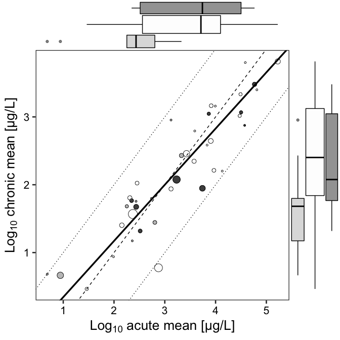
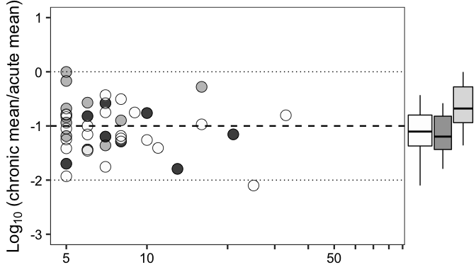
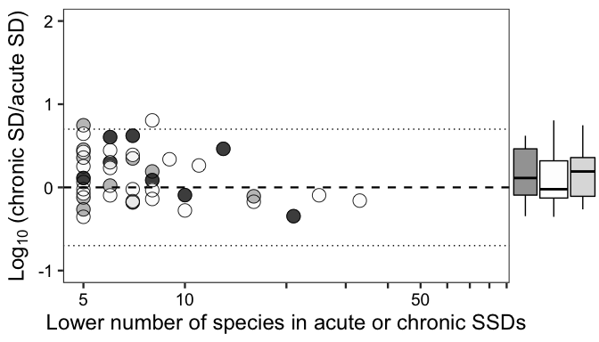
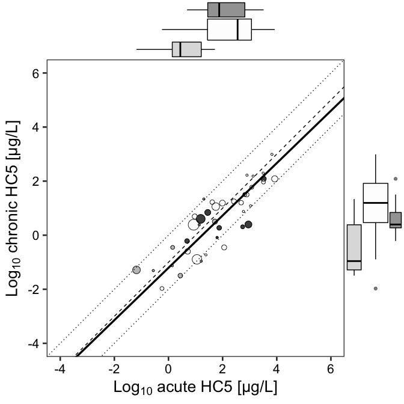

Chronic SSD prediction
================
Kyoshiro HIKI

``` r
knitr::opts_chunk$set(echo = TRUE, message=FALSE,fig.path = "SSD_chronic_figs/figs-",fig.width=7,fig.height=7) #echo=TRUE
```

### 1: Install and load the necessary packages

``` r
library(openxlsx)
library(tidyverse)
```

    ## ─ Attaching packages ────────────────────────────────────── tidyverse 1.3.0 ─

    ## ✓ ggplot2 3.3.0     ✓ purrr   0.3.3
    ## ✓ tibble  3.0.0     ✓ dplyr   0.8.5
    ## ✓ tidyr   1.0.2     ✓ stringr 1.4.0
    ## ✓ readr   1.3.1     ✓ forcats 0.5.0

    ## ─ Conflicts ─────────────────────────────────────── tidyverse_conflicts() ─
    ## x dplyr::filter() masks stats::filter()
    ## x dplyr::lag()    masks stats::lag()

``` r
library(ggplot2)
library(ggExtra)
library(smatr)
library(EnvStats)
```

    ## 
    ## Attaching package: 'EnvStats'

    ## The following objects are masked from 'package:stats':
    ## 
    ##     predict, predict.lm

    ## The following object is masked from 'package:base':
    ## 
    ##     print.default

### 2: Import the example dataset

#### This dataset "example.xlsx" includes 20,000 test records randomly selected from the "EnviroTox" database only for demonstration.

#### All the data used in this study was collected from the "EnviroTox" database and please contact the authors if you like to exactly reproduce our results.

``` r
EnviroTox_test <- read.xlsx("example.xlsx", sheet=1)
EnviroTox_chem <- read.xlsx("example.xlsx", sheet=2)
EnviroTox_taxo <- read.xlsx("example.xlsx", sheet=3)
```

### 3: Select and process the data

``` r
EnviroTox_test_selected <- EnviroTox_test %>%
  filter (Test.statistic=="EC50" & Test.type=="A" | Test.statistic=="LC50" & Test.type=="A" | Test.statistic=="NOEC" & Test.type=="C" | Test.statistic=="NOEL" & Test.type=="C") %>% 
  filter (Effect.is.5X.above.water.solubility =="0") %>%
  mutate (original.CAS = EnviroTox_chem[match(.$CAS, EnviroTox_chem$CAS),"original.CAS"] ) %>%
  mutate_at(vars(Effect.value), as.numeric) %>%
  mutate (Effect.value = replace(.$Effect.value, !is.na(.$Effect.value), .$Effect.value * 10^3) ) %>%  # transform unit (mg/L to ug/L)
  mutate (Unit = replace(Unit, Unit=="mg/L","µg/L"))


# calculate geometric mean
EnviroTox_test_selected2 <- aggregate(EnviroTox_test_selected$Effect.value,
by=list(original.CAS = EnviroTox_test_selected$original.CAS, Test.type=EnviroTox_test_selected$Test.type, Latin.name=EnviroTox_test_selected$Latin.name), function(x) geoMean(x) ) %>%
    rename(Effect.value=x) %>%
    mutate (Trophic.Level = EnviroTox_taxo[match (.$Latin.name, EnviroTox_taxo$Latin.name) ,"Trophic.Level"] )
```

### 4: SSD estimation

``` r
EnviroTox_ssd <- aggregate(x=as.numeric(EnviroTox_test_selected2$Effect.value),
                        by=list(original.CAS=EnviroTox_test_selected2$original.CAS,
                                Test.type=EnviroTox_test_selected2$Test.type),
                        FUN=function(x) mean(log10( x ) ) )  %>%
  mutate(sd=aggregate(EnviroTox_test_selected2$Effect.value,
                      by=list(EnviroTox_test_selected2$original.CAS, EnviroTox_test_selected2$Test.type),
                      function(x) sd(log10( x ) ) )[,3]   )   %>%
  rename(mean=x) %>%
  mutate(HC5 = qlnorm (0.05, meanlog=log(10^mean), sdlog=log(10^sd) ) ) %>%
  mutate (Substance=EnviroTox_chem[match (.$original.CAS, EnviroTox_chem$original.CAS) ,"Chemical.name"]) %>%
  mutate (No_species = aggregate(EnviroTox_test_selected2$Latin.name,
                                by=list(EnviroTox_test_selected2$original.CAS,EnviroTox_test_selected2$Test.type),
                                function(x) length(unique(x)) )[,3]) %>%
  filter(!is.na(sd)) %>%
  mutate(Test.type = replace(Test.type, Test.type=="A", "Acute")) %>%
  mutate(Test.type = replace(Test.type, Test.type=="C", "Chronic"))%>%
  pivot_wider(names_from=Test.type, values_from=c("mean","sd","HC5","No_species")) %>%
  mutate (ConsensusMoA = EnviroTox_chem[match (.$original.CAS, EnviroTox_chem$original.CAS), "Consensus.MOA"] ) %>%
  mutate (ASTER = EnviroTox_chem[match (.$original.CAS, EnviroTox_chem$original.CAS) ,"ASTER"] )

EnviroTox_ssd$ConsensusMoA <- replace (EnviroTox_ssd$ConsensusMoA, which(EnviroTox_ssd$ConsensusMoA=="N"),"Narcotic")
EnviroTox_ssd$ConsensusMoA <- replace (EnviroTox_ssd$ConsensusMoA, which(EnviroTox_ssd$ConsensusMoA=="U"),"Unclassified")
EnviroTox_ssd$ConsensusMoA <- replace (EnviroTox_ssd$ConsensusMoA, which(EnviroTox_ssd$ConsensusMoA=="S"),"Specifically acting")
EnviroTox_ssd$ConsensusMoA <- as.factor(EnviroTox_ssd$ConsensusMoA)
```

### 5: Select the data based on the number of species

``` r
EnviroTox_ssd_HH <- EnviroTox_ssd %>%
  filter (No_species_Acute >= 5 & No_species_Chronic >= 5) %>%
  separate (Substance, into=c("Short_name"), sep=";", extra="drop")
#check the number of SSDs
# Acute and chronic SSDs for a total of 40 chemicals were derived in this case.
dim(EnviroTox_ssd_HH)
```

    ## [1] 40 12

### 6: Fig.1A Relationship between chronic and acute SSD means

``` r
# standardized major axis regression
fit_mean_sma <- sma(data=EnviroTox_ssd_HH, mean_Chronic ~ mean_Acute)

# plot
mean_plot <-  ggplot(data=EnviroTox_ssd_HH, aes(x=mean_Acute, y=mean_Chronic, size=pmin(No_species_Chronic,No_species_Acute) ))+
  geom_point(alpha=0.9, aes(color=ConsensusMoA) )+
  geom_point(alpha=0.9, pch=21)+
  geom_abline(slope=1, intercept=0,size=0.5, lty="dotted")+
  geom_abline(slope=1, intercept=-1,size=0.5, lty="dashed")+
  geom_abline(slope=1, intercept=-2,size=0.5, lty="dotted")+
  theme_bw(base_size=20) +
  theme(axis.text = element_text(color="black"), panel.grid=element_blank(), legend.position = 'none' )+
  scale_color_grey(start=0.2,end=0.99)+
  xlab(expression(paste(Log[10]," acute mean [μg/L]")) )+
  ylab(expression(paste(Log[10]," chronic mean [μg/L]")) )+
  geom_abline(intercept=fit_mean_sma$coef[[1]][1,1], slope=fit_mean_sma$coef[[1]][2,1], col="black", size=1.2)
ggMarginal(mean_plot, type = "box", margins = "both", size = 5, groupFill = TRUE)
```



### 7: Fig. 1B Relationship between chronic and acute SSD SDs

``` r
# standardized major axis regression
fit_sd_sma <- sma(data=EnviroTox_ssd_HH, sd_Chronic ~ sd_Acute)

#plot
sd_plot <-  ggplot(data=EnviroTox_ssd_HH, aes(x=sd_Acute, y=sd_Chronic, size=pmin(No_species_Chronic, No_species_Acute) ))+
  geom_point(alpha=0.9, aes(color=ConsensusMoA) )+
  geom_point(alpha=0.9,pch=21)+
  geom_abline(slope=1, intercept=log10(5), size=0.5, lty="dotted")+
  geom_abline(slope=1, intercept=0, size=0.5, lty="dashed")+
  geom_abline(slope=1, intercept=-log10(5), size=0.5, lty="dotted")+
  theme_bw(base_size=20) + 
  theme(axis.text = element_text(color="black"), panel.grid=element_blank(), legend.position = 'none' )+
  scale_color_grey(start=0.2, end=0.99)+
  xlim(0, 3.5) + ylim(0, 3.5)+
  xlab(expression(paste(Log[10]," acute SD [μg/L]")) )+
  ylab(expression(paste(Log[10]," chronic SD [μg/L]")) )+
  geom_abline(intercept=fit_sd_sma$coef[[1]][1,1], slope=fit_sd_sma$coef[[1]][2,1], col="black", size=1.2)
ggMarginal(sd_plot,type = "box",margins = "both", size = 5, groupFill = TRUE)
```


### 8: Fig. 2 Relationship between the number of species and ratios of chronic to acute SSD parameters

``` r
#Fig. 2A
mean_species <- ggplot(data=EnviroTox_ssd_HH, aes(y=mean_Chronic - mean_Acute, x=pmin(No_species_Chronic, No_species_Acute)))+
  geom_point(alpha=0.9, size=5, aes(color=ConsensusMoA) )+
  geom_point(alpha=0.9, size=5, pch=21)+
  geom_abline(intercept=0, slope=0, lty="dotted")+
  geom_abline(intercept=-2, slope=0, lty="dotted")+
  geom_abline(slope=0, intercept=-1, lty="dashed", size=0.8)+
  scale_color_grey(start=0.2,end=0.99, name="MoA")+
  scale_x_continuous(breaks=c(5,seq(10,100,by=10)), labels=c("5","10",rep("",3),"50",rep("",5)),limits=c(5,80),trans="log10")+
  theme_bw(base_size=18)+  ylim(-3,1)+
  theme(axis.text = element_text(color="black"), panel.grid=element_blank(), legend.position="none", axis.title.x=element_blank() )+
  xlab("")+
  ylab(expression(paste(Log[10]," (chronic mean/acute mean)")) )
ggMarginal(mean_species, type = "box", margins="y", size = 5, groupFill = TRUE)
```



``` r
#Fig. 2B
sd_species <-  ggplot(data=EnviroTox_ssd_HH, aes(y=sd_Chronic - sd_Acute, x=pmin(No_species_Chronic, No_species_Acute) ))+
  geom_point(alpha=0.9, size=5, aes(color=ConsensusMoA) )+
  geom_point(alpha=0.9, size=5, pch=21)+
  geom_abline(slope=0, intercept=0, lty="dashed", size=0.8)+
  geom_abline(slope=0, intercept=-0.7, lty="dotted")+
  geom_abline(intercept=0.7, slope=0, lty="dotted")+
  scale_color_grey(start=0.2, end=0.99, name="MoA")+
  scale_x_continuous(breaks=c(5,seq(10,100,by=10)), labels=c("5","10",rep("",3),"50",rep("",5)), limits=c(5,80),trans="log10")+
  theme_bw(base_size=18)+
  ylim(-1,2)+
  theme(axis.text = element_text(color="black"), panel.grid=element_blank(), legend.position="none")+
  xlab("Lower number of species in acute or chronic SSDs")+
  ylab(expression(paste(Log[10]," (chronic SD/acute SD)")) )
ggMarginal(sd_species, type = "box", margins="y", size = 5, groupFill = TRUE)
```



### 9: Fig.3 Relationship between chronic and acute HC5

``` r
#standardized major axis regression
fit_hc5_sma <- sma (data=EnviroTox_ssd_HH, log10(HC5_Chronic) ~ log10(HC5_Acute) )

#plot
HC5_plot <-  ggplot(data=EnviroTox_ssd_HH, aes(x=log10(HC5_Acute), y=log10(HC5_Chronic), size=pmin(No_species_Chronic, No_species_Acute) ) )+
  geom_point(alpha=0.9, aes(color=ConsensusMoA) )+
  geom_point(alpha=0.9, pch=21)+
  geom_abline(slope=1, intercept=0, size=0.5, lty="dotted")+
  geom_abline(slope=1, intercept=-1, size=0.5, lty="dashed")+
  geom_abline(slope=1, intercept=-2, size=0.5, lty="dotted")+
  theme_bw(base_size=20) +
  xlim(-4,6) + ylim(-4,6)+
  theme(axis.text = element_text(color="black"), panel.grid=element_blank(), legend.position = 'none' )+
  scale_color_grey(start=0.2, end=0.99)+
  xlab(expression(paste(Log[10]," acute HC5 [μg/L]")) )+
  ylab(expression(paste(Log[10]," chronic HC5 [μg/L]")) )+
  geom_abline(intercept=fit_hc5_sma$coef[[1]][1,1], slope=fit_hc5_sma$coef[[1]][2,1], col="black",size=1.2)
ggMarginal(HC5_plot,type = "box",margins = "both", size = 5, groupFill = TRUE)
```


